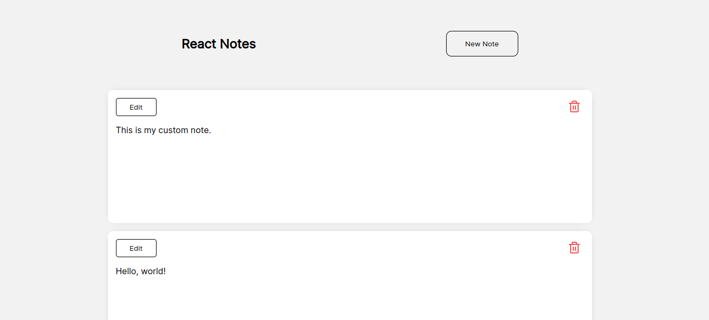

# React Notes
This is a small sample project where I created a notes website using just React.



This project was created using React Hooks. The intention was to be simple.

---

## Maybe?
- [ ] Dark theme support
- [ ] Change website title and favicon
- [ ] Markdown support
- [ ] See when the note was created

---

## How to Install

You must have Node.js and Yarn installed on the machine.

```sh
# Clone the repository
git clone git@github.com:soukyomi/react-notes.git

# Enter the project folder
cd react-notes

# Install the dependencies
yarn

# Run the project
yarn start

# Your browser should open automatically
```
